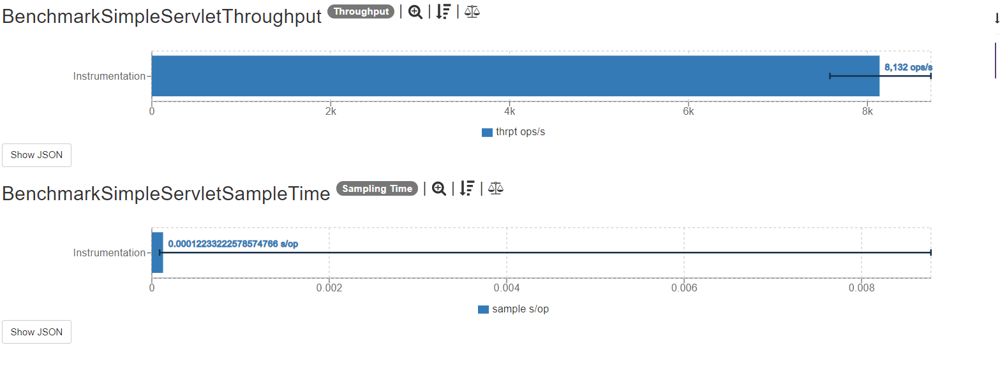
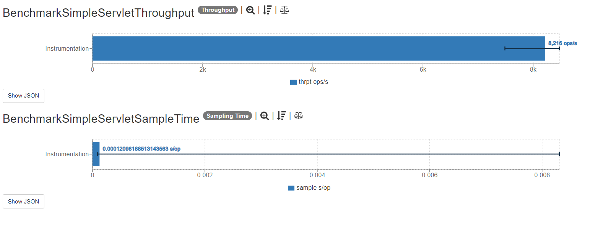

## Description

These tests use a [servlet example](https://www.ntu.edu.sg/home/ehchua/programming/java/JavaServlets.html) application to process a GET request and return an HTML page with information of the request an a random number assigned.

Using Undertow Deployment API the servlet is deployed, and a new instance off Undertow server is launched in [`BenchmarkSimpleServletBase`](src/main/java/io/opentracing/contrib/benchmarks/BenchmarkSimpleServletBase.java) 

The tracer is injected using the OpenTelemetry auto-instrumentation java-agent.

The tests consist of making a simple request using unirest to get the hello world page in a not instrumentation scenario and instrumented with different tracers.

```java
String r = Unirest.get("http://" + HOST + ":" + PORT + "/").asString().getBody();
```

## Dependencies

This project uses this [Opentelemetry dependency](https://github.com/open-telemetry/opentelemetry-java-instrumentation).
The javaagent serves as a tool to inject tracers and instrument the application.The project additionally requires a running Jaeger tracer. The simplest way to start the Jaeger all-in-one is to use the pre-built image published to DockerHub (a single command line).

```docker
  docker run -d --name jaeger \
  -e COLLECTOR_ZIPKIN_HOST_PORT=:9411 \
  -p 5775:5775/udp \
  -p 6831:6831/udp \
  -p 6832:6832/udp \
  -p 5778:5778 \
  -p 16686:16686 \
  -p 14268:14268 \
  -p 14250:14250 \
  -p 9411:9411 \
  jaegertracing/all-in-one:1.24


```
It also requires a running the OpenTelemetry collector to account for the OTLP trace exporter. The collector can be started using the pre-built image published on DockerHub.

```docker
docker run --publish 4317:4317 otel/opentelemetry-collector
```


## Results

The latest results are located [here]().
Graphs are constructed based on raw results located in the ``results`` folder.

### SampleTime metrics

- X axis: represents each execution result.
- Y axis: represents how long time it takes for the benchmark method to execute.

### Throughput metrics

- X axis: represents each execution result.
- Y axis: represents of number of operations per second  (the number of times per second the benchmark method could be executed).

### OTLP Trace Exporter Instrumentation metrics


### Jaeger Trace Exporter Instrumentation metrics



## Environment
The tests were executed in a Linux Bare Metal machine with the following characteristics: 

- OS: CentOS 8
- RAM: 32 GB
- Disk: 1 x 240GB SSD
- Processor: 1 x Intel(R) Xeon(R) CPU E3-1578L v5 @ 2.00GHz


