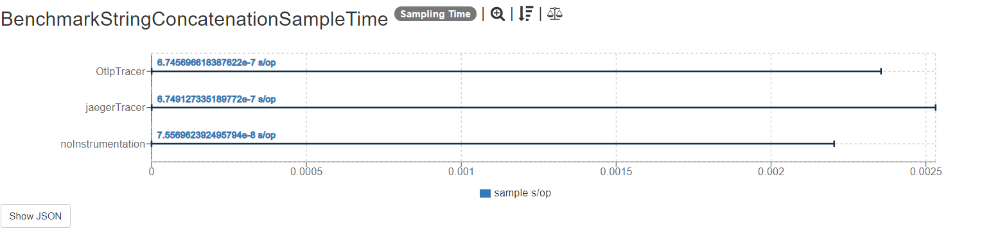
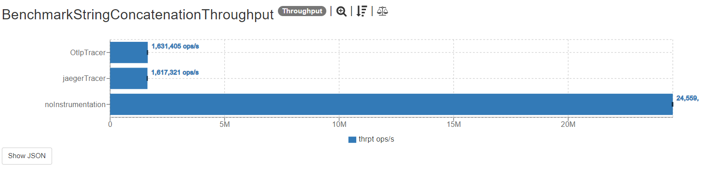

## Description

These tests measure the cost of a simple string concatenation using two constant strings "Hello" and "world" with an iteration number i. The tests use the OpenTelemetry SDK to instrument the code and then use two different trace exporters to send trace data. The Jaeger and the OTLP trace exporters are used to create spans and set attribute data, and additionally log the resultatnt message of string concatenation. 

## Dependencies

This project uses this [Opentelemetry dependency](https://github.com/open-telemetry/opentelemetry-java):

```xml
  <project>
  <dependencyManagement>
    <dependencies>
      <dependency>
        <groupId>io.opentelemetry</groupId>
        <artifactId>opentelemetry-bom</artifactId>
        <version>1.1.0</version>
        <type>pom</type>
        <scope>import</scope>
      </dependency>
    </dependencies>
  </dependencyManagement>
  <dependencies>
    <dependency>
      <groupId>io.opentelemetry</groupId>
      <artifactId>opentelemetry-api</artifactId>
    </dependency>
  </dependencies>
</project>

```

Additionally, it also uses the following tracer dependencies

```xml
        <dependency>
            <groupId>io.opentelemetry</groupId>
            <artifactId>opentelemetry-exporter-jaeger</artifactId>
        </dependency>
        <dependency>
            <groupId>io.opentelemetry</groupId>
            <artifactId>opentelemetry-exporter-otlp</artifactId>
        </dependency>
```

## Results

The latest results are located [here]().
Graphs are constructed based on raw results located in the ``results`` folder.

## SampleTime metrics

- X axis: represents each execution result.
- Y axis: represents how long time it takes for the benchmark method to execute.



## Throughput metrics

- X axis: represents each execution result.
- Y axis: represents of number of operations per second  (the number of times per second the benchmark method could be executed).




## Environment
The tests were executed in a personal notebook with these characteristics:

- Model Name: Lenovo IdeaPad 530S-15IKB
- Processor Name:	Intel Core i5 8th gen
- Processor Speed:	1.8 GHz
- Number of Processors:	8
- Number of Cores: 4
- L1 Cache: 256 KB
- L2 Cache:	1.0 MB
- L3 Cache:	6.0 MB
- Memory:	8 GB

