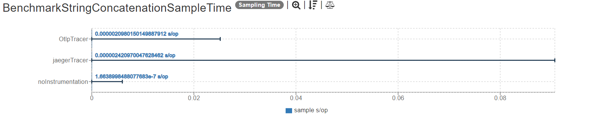
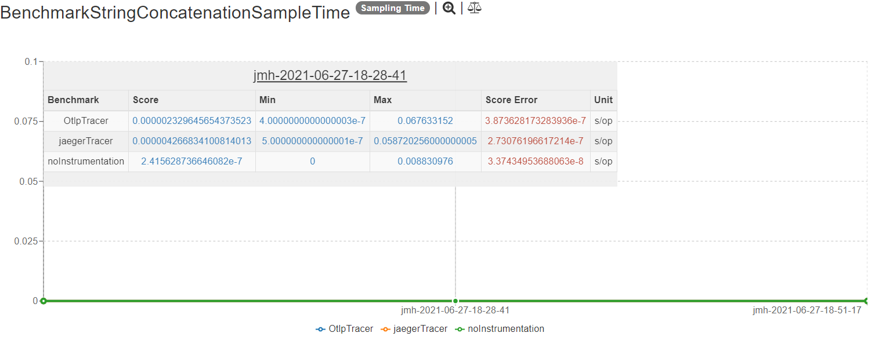
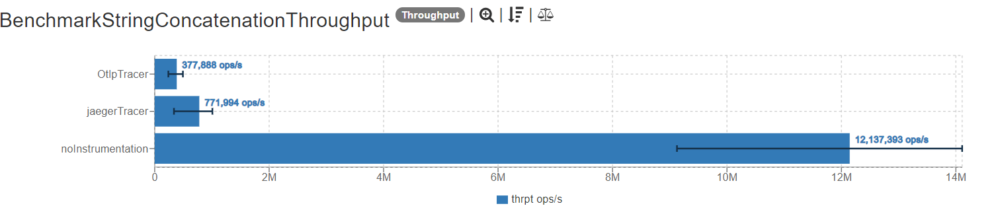
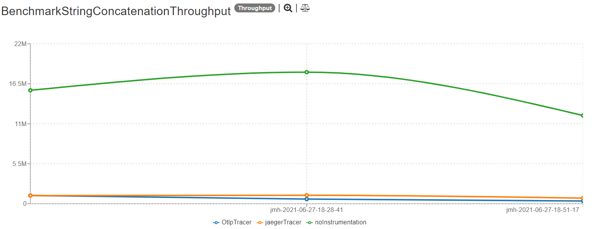

## Description

These tests use the petclinic sample spring-based application. The application is initialized for each test iteration in the BenchmarkPetclinicBase, and using profiles, the right tracer is injected in TracerConfiguration.

The different tests measure the process of finding a pet owner by id in a non instrumentation scenario and when instrumented with different tracers. The tests are performing the operation calling to the Spring services directly. 

## Dependencies

This project uses this [Opentelemetry dependency](https://github.com/open-telemetry/opentelemetry-java):

```xml
    <project>
  <dependencyManagement>
    <dependencies>
      <dependency>
        <groupId>io.opentelemetry</groupId>
        <artifactId>opentelemetry-bom</artifactId>
        <version>1.1.0</version>
        <type>pom</type>
        <scope>import</scope>
      </dependency>
    </dependencies>
  </dependencyManagement>
  <dependencies>
    <dependency>
      <groupId>io.opentelemetry</groupId>
      <artifactId>opentelemetry-api</artifactId>
    </dependency>
  </dependencies>
</project>

```

Additionally, it also uses the following tracer dependencies

```xml
    <dependency>
            <groupId>io.opentelemetry</groupId>
            <artifactId>opentelemetry-exporter-jaeger</artifactId>
        </dependency>
        <dependency>
            <groupId>io.opentelemetry</groupId>
            <artifactId>opentelemetry-exporter-otlp</artifactId>
        </dependency>
        <dependency>
            <groupId>io.opentelemetry</groupId>
            <artifactId>opentelemetry-extension-noop-api</artifactId> 
            <version>1.3.0-alpha</version>   
        </dependency>
        <dependency>
            <groupId>io.opentelemetry</groupId>
            <artifactId>opentelemetry-sdk</artifactId>
        </dependency>
```

## Results

The latest results are located [here]().
Graphs are constructed based on raw results located in the ``results`` folder.

## SampleTime metrics

- X axis: represents each execution result.
- Y axis: represents how long time it takes for the benchmark method to execute.





## Throughput metrics

- X axis: represents each execution result.
- Y axis: represents of number of operations per second  (the number of times per second the benchmark method could be executed).






## Environment
The tests were executed in a personal notebook with these characteristics:

- Model Name: Lenovo IdeaPad 530S-15IKB
- Processor Name:	Intel Core i5 8th gen
- Processor Speed:	1.8 GHz
- Number of Processors:	8
- Number of Cores: 4
- L1 Cache: 256 KB
- L2 Cache:	1.0 MB
- L3 Cache:	6.0 MB
- Memory:	8 GB

